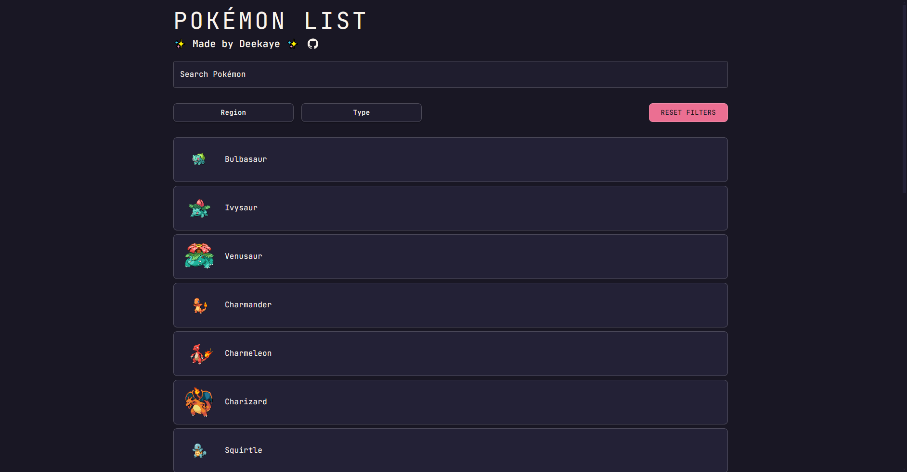

# 🎮 Pokémon List App

> _There are tons of these around — but this one is mine._

A fun little project to practice **React**, explore **APIs**, and play with modern **UI libraries**.  
Data is fetched from [PokeAPI](https://pokeapi.co/).

---

## 🛠️ Built With

- ⚛️ **React**
- 🎨 **MUI** (Material UI)
- 📦 **Axios**
- 🔁 **Redux Toolkit**
- 💅 **Emotion (CSS-in-JS)**

---

## ✅ Features

- 🔍 Search Pokémon
- 📄 Modal popup with detailed stats
- ✨ Shiny variations
- 🌍 Region filters
- 🧬 Type filters
- 📃 Pagination

---

## 🧠 To-Do / Roadmap

- [x] Basic pages
- [x] Modal with Pokémon info
- [x] Shiny support
- [x] Filter by region & type
- [x] Responsive sprite display
- [ ] ✨ Reorganize modal layout
- [ ] 🛎️ Add Snackbar when filters are cleared
- [ ] ⭐ Add favorites (maybe using [MUI Bottom Navigation](https://mui.com/material-ui/react-bottom-navigation/))
- [ ] ⚙️ Add abilities
- [ ] 📱 Port to [React Native](https://reactnative.dev)

---

## 🖼️ Preview

---

## 📝 Notes

This project is mainly for learning.  
Pull requests, suggestions, or feedback are always welcome!
